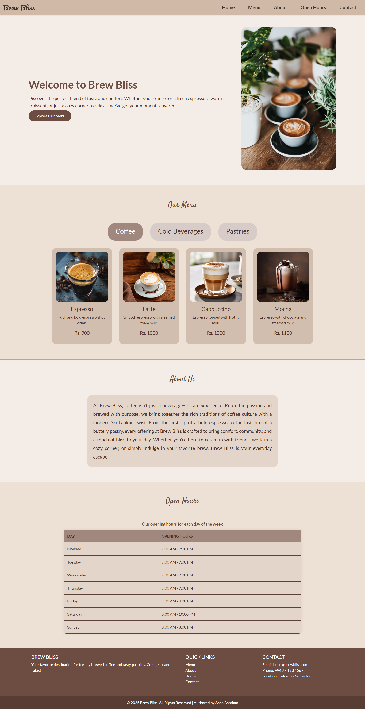

# ☕ Brew Bliss – Coffee Shop Website

Brew Bliss is a modern and responsive website for a fictional coffee shop. Designed to be clean, warm, and user-friendly, the site highlights a categorized menu, inviting visuals, and a pleasant browsing experience.

## 🖼️ UI Screenshot



## ✨ Features

- Interactive menu with categories (Coffee, Pastries, Cold Beverages)
- Fully responsive and mobile-friendly 
- Clean layout with a cozy color palette
- JavaScript-powered content switching
- Smooth UI for showcasing products and information

## 🛠️ Technologies Used

- HTML5  
- CSS3  
- Bootstrap 5  
- JavaScript 
- Git & GitHub for version control and deployment

## 📱 Responsive Design

Built with mobile-first principles. Compatible across various devices and screen sizes.

## 🔗 Live Demo

[Click here to view the website](https://asnaassalam.github.io/brew-bliss-website/)    

## 📥 How to Clone

To clone the project locally:

```bash
git clone https://github.com/asnaassalam/brew-bliss-website.git
cd brew-bliss-website


